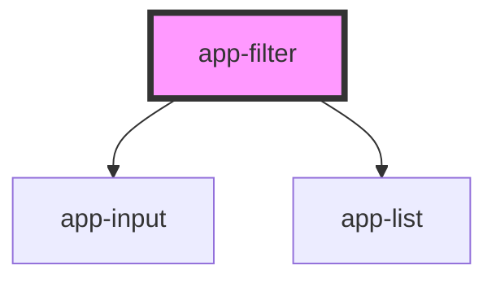

# app-filter

<!-- Auto Generated Below -->

## Properties

| Property | Attribute | Description | Type    | Default     |
| -------- | --------- | ----------- | ------- | ----------- |
| `data`   | --        |             | `any[]` | `undefined` |

## Events

| Event           | Description | Type               |
| --------------- | ----------- | ------------------ |
| `filterApplied` |             | `CustomEvent<any>` |

## Dependencies

### Depends on

- [app-input](../app-input)
- [app-list](../app-list)

### Graph

----------------------------------------------

*Built with [StencilJS](https://stenciljs.com/)*
