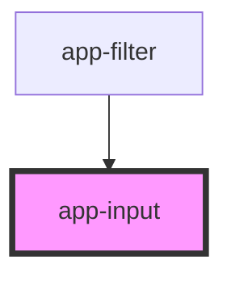

# app-input

<!-- Auto Generated Below -->

## Properties

| Property      | Attribute     | Description | Type     | Default     |
| ------------- | ------------- | ----------- | -------- | ----------- |
| `field`       | `field`       |             | `string` | `undefined` |
| `placeholder` | `placeholder` |             | `string` | `undefined` |
| `type`        | `type`        |             | `string` | `undefined` |

## Events

| Event          | Description | Type               |
| -------------- | ----------- | ------------------ |
| `inputChanged` |             | `CustomEvent<any>` |

## Dependencies

### Used by

 - [app-filter](../app-filter)

### Graph

----------------------------------------------

*Built with [StencilJS](https://stenciljs.com/)*
